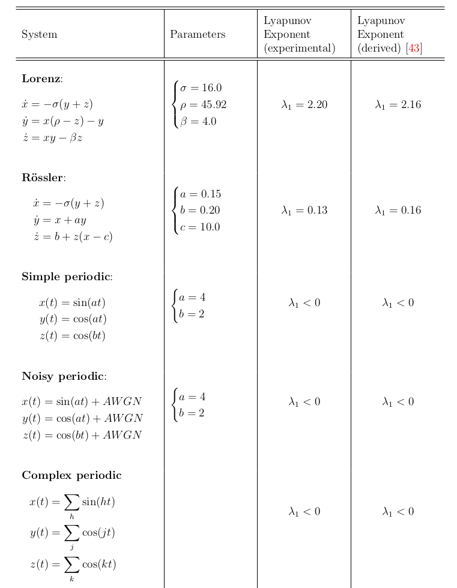
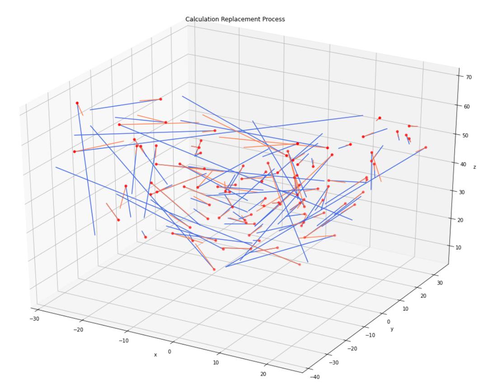

# lyapunov-exponent-estimate

Estimating largest Lyapunov exponent of time series data in Python using the method of Wolf et al. [1]

## Background

Mathematical chaos has a variety of definitions. The definition given by Strogatz states:

<b>Chaos</b> is aperiodic long-term behavior in a deterministic system that exhibits sensitive dependence on initial conditions [2].

Based on this definition, for any two starting points that are close in space, as the system progresses through time, these trajectories will diverge from each other at an exponential rate. This is known in layman's terms as the butterfly effect.

A common measure for chaos is the **Lyapunov exponent**, which is roughly defined as the natural log of the divergence of two trajectories. For example, the Lorenz attractor has a Lyapunov exponent of 2.16. A periodic dynamic system or a dynamic system with a stable attracting point, on the other hand, would not have a positive exponent.

***Knowing this, you might wonder if you can identify chaotic behavior in experimental data by estimating Lyapunov exponent.***

## Project Overview

In the 80's, Wolf et al. demonstrated a method to computationally estimate the Lyapunov exponent of timeseries data, based on a derived method that requires differential equations of the system [1].  The original paper included code that implemented this in Fortran. 
***This repo ports this code to Python for ease of inclusion in modern-day projects.***

There are two main functions implemented in this codebase: `lyapunov_solve` and `lyapunov_solve_unknown`.

`lyapunov_solve(x, step_sz, period, ...)` is a function that allows for finetuning of parameters as described in the paper, and can achieve high accuracy for dynamic systems with known Lyapunov exponents. In this function, the period is an "indicative period" of the trajectory orbit. Of course, a truly chaotic system has no period.

`lyapunov_solve_unknown(x, step_sz)`, in which the indicative period is estimated using FFT, therefore only requiring timeseries data and the time interval between samples. It is more inaccurate, but could be useful when attempting to automate a search for chaotic systems.

 

---

## Testing the code

Fig. 1. Estimation using the `lyapunov_solve` function with fine-tuning for the indicative time period of the dynamic system. A characteristic time for the Lorenz system is 0.5 s, and for the Roessler system, 6 s.

Fig. 2. Visualization of the primary axis replacement process in `lyapunov_solve`. The red point marks the fiducial trajectory, the blue line marks the evolved primary axis, and the orange line represents the "orthonormalized" primary axis.

---

## Additional Background on Paper

Given the differential equations, it is possible to derive the spectrum of Lyapunov exponents (corresponding to different vectors of divergence) by evolving a small sphere according to the equations of motion. To control for the divergence in magnitude over time, the vectors are regularly orthonormalized using the Gram-Schmidt procedure.

The method of Wolf et al. treats points on a trajectory that are close in proximity, but on separate orbits, as points on separate trajectories. Stepping forward in time, these points will diverge. We choose our initial point on the trajectory, which we'll call our fiduciary trajectory. We take the closest point as an approximation of the axis for the largest Lyapunov exponent. We then step forward a bit in time, and then instead of orthonormalizing, we replace the diverging point with the closest point to the fiduciary trajectory at this time step. By averaging this process over many timesteps and replacements, we can attempt to approximate the largest Lyapunov exponent. This was demonstrated to work for the Lorenz and Roessler attractors with appropriate selection of calculation parameters.

[1] Wolf, Alan, et al. "Determining Lyapunov exponents from a time series." *Physica D: nonlinear phenomena 16.3* (1985): 285-317.

[2] Strogatz, Steven H. *Nonlinear dynamics and chaos: with applications to physics, biology, chemistry, and engineering.* CRC press, 2018.

